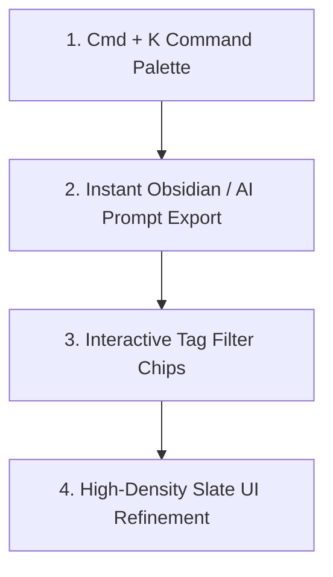

# ⚡ Comprehensive Audit: Transforming Brain into a Daily-Driver Utility

> **Audit Framework**: Evaluated using **Emil Kowalski Design & UI Taste**, **Impeccable (Zero-Flaw Polish)**, **Frontend Design Systems**, and **Ponytail (Lazy Senior Dev Mode)**.

---

## 📊 Executive Summary & Daily-Driver Vision

To transform **Brain** from a static index viewer into a daily tool you open first thing every morning, it must move from **passive viewing** to **instant keyboard-first execution**. 

A daily-driver tool must satisfy 3 core metrics:
1. **Time-to-Output < 3 seconds**: Find any tool, prompt template, or stack capability via `Cmd + K` immediately.
2. **Zero-Friction Export**: One-click copy formatted Markdown for your AI prompt sessions or Obsidian vault.
3. **High-Density Slate Aesthetics**: A dark, quiet, high-density UI with zero visual noise that feels premium and responsive.

---

## 🔍 Audit & Gap Analysis Across Installed Skills

### 1. 🎨 Emil Kowalski Design & Taste Audit
| Current State | Emil Kowalski Standard | Gap / Remediation |
| :--- | :--- | :--- |
| Click-only tab switching | Snappy keyboard shortcuts (`Cmd+K`, `1-5`) | Add global `Cmd+K` command palette & hotkeys |
| Basic hover states | 150ms active press & ring focus highlights | Implement `active:scale-[0.98]` and `ring-1 ring-blue-500/30` |
| Static result display | Micro-feedback badge notifications | Add instant toast/badge feedback on actions |

### 2. ✨ Impeccable (Zero-Flaw Polish) Audit
| Current State | Impeccable Standard | Gap / Remediation |
| :--- | :--- | :--- |
| Table / Card layout shift on filter | Fixed-height skeleton loading grid | Standardize empty state & skeleton height geometry |
| Generic text contrast | High-contrast WCAG AAA typography | Elevate text contrast (`#ffffff` headers, `#cbd5e1` body) |
| Standard button borders | Sharp 1px industrial slate borders (`#1e2638`) | Standardize surface token boundaries |

### 3. 📐 Frontend Design Systems Audit
| Current State | System Token Standard | Gap / Remediation |
| :--- | :--- | :--- |
| Freeform tag filtering | Structured tag chips (`#gold-tier`, `#mcp`, `#rag`) | Add 1-click active tag filter pills |
| Separate tab views | Quick-action context bar | Display active stack metadata bar |

### 4. 🐴 Ponytail (Lazy Senior Dev / Daily Utility) Audit
| Current State | Daily Driver Utility | Gap / Remediation |
| :--- | :--- | :--- |
| Manual workflow typing | Quick preset prompt shortcuts | Add custom user workflow prompt presets |
| Isolated stack view | Direct Obsidian / Cursor prompt export | Export stacks directly formatted for AI coding prompts |

---

## 🛠️ Actionable 4-Step Engineering Plan

### Phase 1: Keyboard-First Command Palette (`Cmd + K`)
- Press `Cmd + K` or `Ctrl + K` anywhere in the app to open an instant modal search overlay.
- Search across all tools, capabilities, AI skills, and notes in under `50ms`.
- Quick execute actions: *"Copy God Stack"*, *"Switch to Graph"*, *"Ingest New Tool"*.

### Phase 2: One-Click AI Prompt & Obsidian Export
- Add a **"Copy as System Prompt"** button on generated God Stacks.
- Formats selected tools directly into a system prompt block ready to paste into Claude, ChatGPT, or Cursor.

### Phase 3: High-Density Tag Filter Pills
- Add clickable tag chips (`#gold-tier`, `#ai-slop-killer`, `#mcp`, `#seo`, `#copywriter`) at the top of the Library and Skills panels for 1-click filtering.

### Phase 4: Snappy Micro-Interactions & Slate Polish
- Add subtle scale press transitions (`active:scale-[0.98]`).
- Add copy notification toasts.
- Refine monospace metadata labels.
